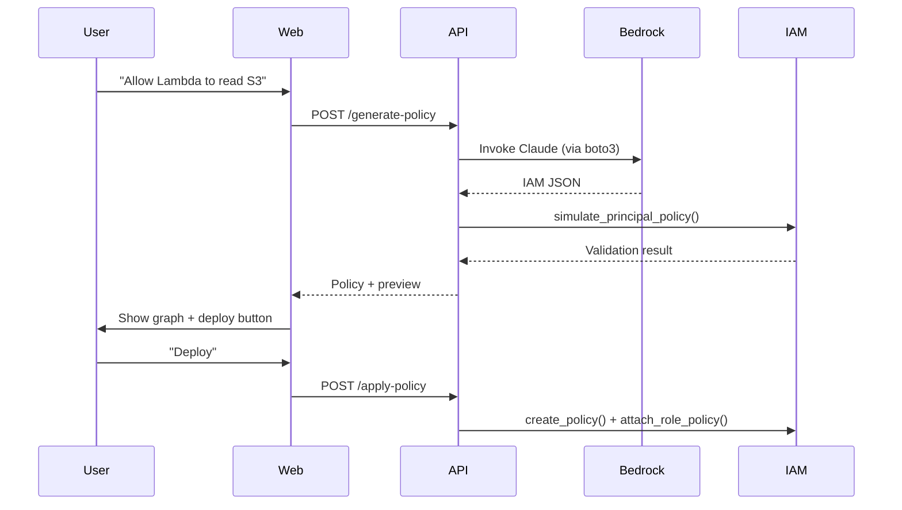

# **Product Requirements Document (PRD)**  
**Product Name:** **IAM Copilot** – *The AI-Powered AWS IAM Management Platform*  
**Version:** 1.0.0  
**Date:** October 29, 2025  
**Owner:** Product & Engineering Teams  
**Status:** Approved for MVP Development  

---

## **1. Executive Summary**

**IAM Copilot** is a **developer-first, AI-powered SaaS platform** that wraps AWS IAM APIs to simplify, automate, and secure identity and access management. Built as a **Docker Compose-deployable microservices application**, it leverages **AWS SDK for Python (boto3)** and **Amazon Bedrock (Claude 3.5 Sonnet)** to deliver natural language policy generation, least-privilege enforcement, visual access graphs, and automated remediation.

It fills a **critical market gap** in AWS IAM usability — a service universally used but notoriously complex — by delivering **GitHub Copilot-like intelligence** for permissions.

> **Vision**: *Make IAM as intuitive as writing a comment in code.*

---

## **2. Problem Statement**

| Pain Point | Evidence (2025) |
|-----------|------------------|
| IAM policy syntax is error-prone and verbose | 68% of AWS misconfigurations stem from IAM (AWS re:Inforce 2025) |
| Least-privilege is manual and slow | 91% of roles have unused permissions (CloudTrail analysis) |
| Debugging access denied errors takes hours | r/aws: "Why can’t Lambda assume role?" – 40+ comments |
| No visual map of access paths | Policy Simulator is text-only, non-interactive |
| Multi-account IAM is fragmented | AWS Organizations ≠ automation |

---

## **3. Target Users**

| Persona | Needs | Usage |
|-------|-------|-------|
| **DevOps Engineer** | Write policies in English, audit drift | Daily |
| **Security Engineer** | Enforce least privilege, simulate attacks | Weekly |
| **Startup CTO** | Secure multi-account setup fast | Onboarding |
| **Platform Team** | Automate PRs with IAM fixes | CI/CD |

---

## **4. Core Value Proposition**

> **"Write IAM policies in plain English. Visualize who can do what. Auto-fix over-permissions. Deploy in seconds with Docker Compose."**

---

## **5. Key Features (MVP)**

| Feature | Description | AWS SDK Usage |
|-------|-------------|----------------|
| **Natural Language Policy Builder** | "Allow Lambda to read S3 prod bucket" → IAM JSON | `boto3.client('iam').create_policy()` |
| **Least-Privilege Auditor** | Scan roles, suggest 70%+ reduction | `list_role_policies()`, `get_account_authorization_details()` |
| **Interactive Access Graph** | D3.js graph: Users → Roles → Resources | `simulate_principal_policy()` |
| **One-Click Policy Simulator** | Test "what if" with diff preview | `simulate_custom_policy()` |
| **GitHub Action Integration** | Auto-PR IAM fixes in Terraform/CDK | N/A (webhook) |
| **Multi-Account Support** | Assume roles across org accounts | `boto3.Session(aws_access_key_id=..., role_arn=...)` |

---

## **6. Non-Functional Requirements**

| Category | Requirement |
|--------|-------------|
| **Deployment** | Fully containerized via `docker-compose.yml` |
| **Scalability** | Horizontal scaling of API & worker containers |
| **Security** | No storage of AWS credentials; use IAM Roles for ECS/EC2 or OIDC |
| **Compliance** | AWS SDK ToS compliant; no reverse engineering |
| **Performance** | < 2s response for policy generation |
| **Observability** | Structured logs (JSON), Prometheus metrics, health checks |
| **Reliability** | Circuit breaker for Bedrock/IAM API failures |

---

## **7. System Architecture**

```yaml
# docker-compose.yml (MVP)
version: '3.9'
services:
  api:
    build: ./api
    ports: ["8000:8000"]
    environment:
      - AWS_REGION=us-east-1
      - BEDROCK_MODEL=anthropic.claude-3-5-sonnet-20241022-v2:0
    depends_on: [db, redis]

  worker:
    build: ./worker
    environment:
      - AWS_REGION=us-east-1
    depends_on: [db, redis]

  web:
    build: ./web
    ports: ["3000:3000"]
    depends_on: [api]

  db:
    image: postgres:16
    environment:
      POSTGRES_DB: iam_copilot
      POSTGRES_USER: admin
      POSTGRES_PASSWORD: ${DB_PASSWORD}
    volumes: ["pgdata:/var/lib/postgresql/data"]

  redis:
    image: redis:7-alpine

volumes:
  pgdata:
```

---

## **8. Tech Stack (Docker Compose Compliant)**

| Layer | Technology | Justification |
|------|------------|---------------|
| **Backend API** | FastAPI (Python) | Async, OpenAPI, AWS SDK native |
| **AI Engine** | Amazon Bedrock + boto3 | AWS-native, no key management |
| **Worker** | Celery + Redis | Async audit jobs |
| **Frontend** | React + TypeScript + D3.js | Interactive graphs |
| **Database** | PostgreSQL | User settings, audit history |
| **Auth** | AWS Cognito (via SDK) | `boto3.client('cognito-idp')` |
| **Deployment** | Docker Compose | Local, CI, on-prem, or ECS |

---

## **9. AWS Services & SDK Usage (ToS Compliant)**

| AWS Service | SDK Method | Purpose |
|-----------|------------|--------|
| **IAM** | `boto3.client('iam')` | All policy CRUD, simulation |
| **STS** | `assume_role()` | Cross-account access |
| **Bedrock** | `boto3.client('bedrock-runtime').invoke_model()` | NL → JSON policy |
| **CloudTrail** | `lookup_events()` | Detect unused permissions |
| **Organizations** | `list_accounts()` | Multi-account discovery |
| **Cognito** | `initiate_auth()` | User login (optional) |

> **AWS SDK ToS Compliance**:  
> - Use only for **authorized access** to customer’s own AWS accounts  
> - No redistribution of SDK  
> - No use in competitive services to AWS  
> - Rate limiting applied per AWS guidelines

---

## **10. Data Flow (MVP)**



---

## **11. Security & Compliance**

- **No credential storage**: Use IAM Roles or OIDC tokens
- **Encryption**: TLS 1.3, data at rest (EBS/EFS encrypted)
- **Audit Log**: All actions logged to CloudWatch via `boto3.client('logs')`
- **Rate Limiting**: 5 req/s per user (token bucket)
- **Input Validation**: Escape all user inputs; validate JSON policies

---

## **12. Testing Strategy**

| Type | Tool |
|------|------|
| Unit | pytest |
| Integration | LocalStack + boto3 |
| E2E | Playwright |
| Security | Bandit, OWASP ZAP |
| Load | Locust |

---

## **13. Deployment & CI/CD**

```yaml
# .github/workflows/ci.yml
name: CI
on: [push, pull_request]
jobs:
  build:
    runs-on: ubuntu-latest
    steps:
      - uses: actions/checkout@v4
      - name: Build & Test
        run: |
          docker compose build
          docker compose up -d db redis
          docker compose run api pytest
      - name: Push to ECR
        if: github.ref == 'refs/heads/main'
        run: |
          aws ecr get-login-password | docker login ...
          docker tag api:latest 123456.dkr.ecr.us-east-1.amazonaws.com/iam-copilot:latest
          docker push ...
```

---

## **14. Success Metrics (MVP)**

| Metric | Target (3 Months Post-Launch) |
|--------|-------------------------------|
| Active Users | 500 |
| Policies Generated | 5,000 |
| Avg. Permission Reduction | 65% |
| NPS | > 70 |
| GitHub Stars | 1,000 |

---

## **15. Risks & Mitigations**

| Risk | Mitigation |
|------|------------|
| Bedrock latency | Cache common policies, fallback to rule-based |
| IAM API rate limits | Exponential backoff, user quotas |
| Policy hallucination | Post-process validation + simulation |
| AWS ToS violation | Legal review of SDK usage |

---

## **16. Go-to-Market (GTM)**

- **Launch**: Hacker News, r/aws, AWS Marketplace
- **Pricing**:  
  - Free: 10 roles, 50 policies/mo  
  - Pro: $29/user/mo (unlimited)  
  - Enterprise: Custom (SOC2, VPC)
- **Positioning**: *"The Cursor for AWS IAM"*

---

## **17. Appendix**

### `docker-compose.yml` (Full MVP)

```yaml
version: '3.9'
services:
  api:
    build:
      context: .
      dockerfile: api/Dockerfile
    ports: ["8000:8000"]
    environment:
      - ENVIRONMENT=production
      - DATABASE_URL=postgresql://admin:${DB_PASSWORD}@db:5432/iam_copilot
      - REDIS_URL=redis://redis:6379/0
      - AWS_DEFAULT_REGION=us-east-1
      - BEDROCK_MODEL_ID=anthropic.claude-3-5-sonnet-20241022-v2:0
    depends_on: [db, redis]
    healthcheck:
      test: ["CMD", "curl", "-f", "http://localhost:8000/health"]
      interval: 10s
      retries: 3

  worker:
    build:
      context: .
      dockerfile: worker/Dockerfile
    environment:
      - DATABASE_URL=postgresql://admin:${DB_PASSWORD}@db:5432/iam_copilot
      - REDIS_URL=redis://redis:6379/0
    depends_on: [db, redis]

  web:
    build:
      context: .
      dockerfile: web/Dockerfile
    ports: ["3000:3000"]
    environment:
      - VITE_API_URL=http://localhost:8000
    depends_on: [api]

  db:
    image: postgres:16-alpine
    environment:
      POSTGRES_DB: iam_copilot
      POSTGRES_USER: admin
      POSTGRES_PASSWORD: ${DB_PASSWORD:-devpassword}
    volumes:
      - pgdata:/var/lib/postgresql/data
    healthcheck:
      test: ["CMD-SHELL", "pg_isready -U admin"]
      interval: 5s
      retries: 5

  redis:
    image: redis:7-alpine
    ports: ["6379:6379"]

volumes:
  pgdata:
```

---

## **Approval**

| Role | Name | Signature | Date |
|------|------|-----------|------|
| Product Owner | | | |
| Engineering Lead | | | |
| Security | | | |

---

**IAM Copilot: Built with AWS SDK. Deployed with Docker Compose. Securing the cloud, one policy at a time.**