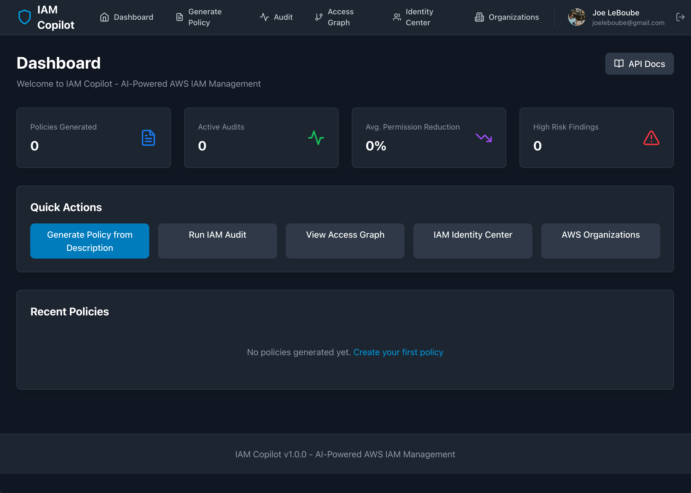
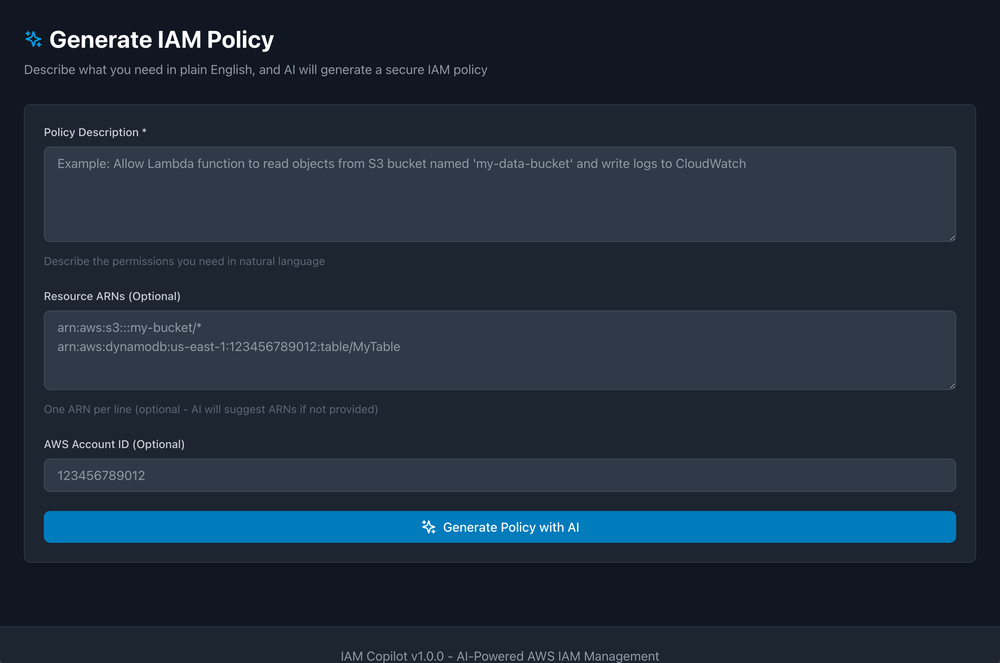
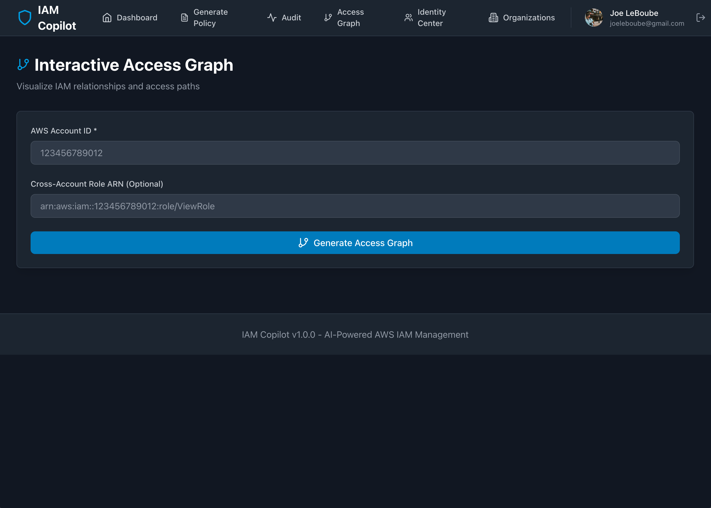
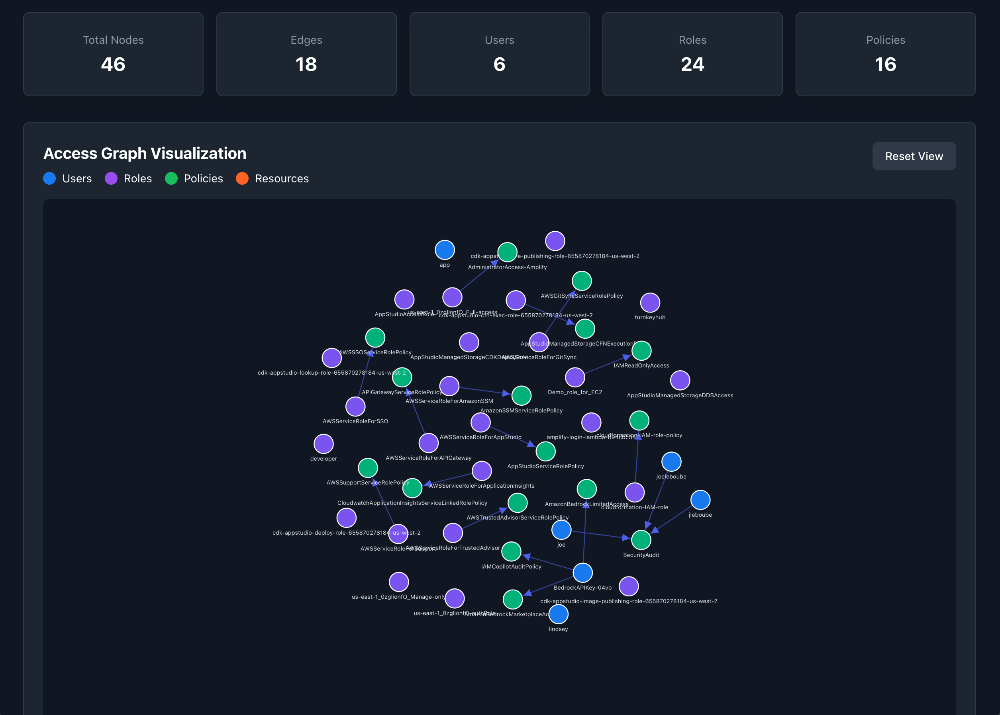
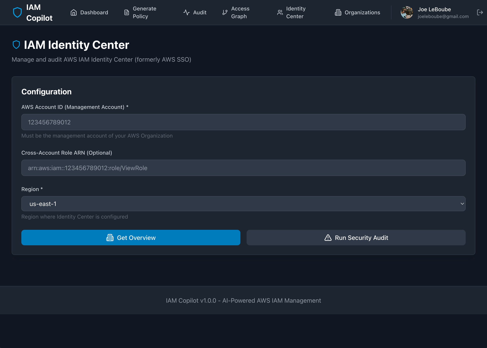
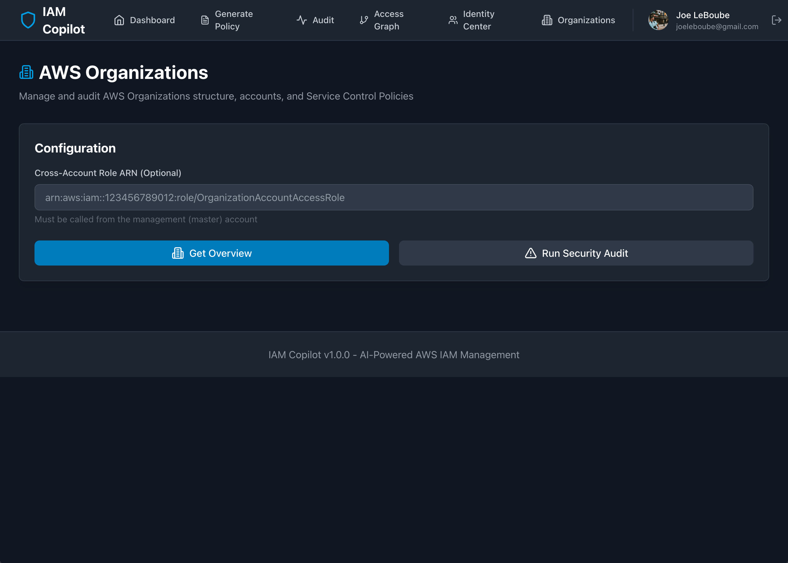
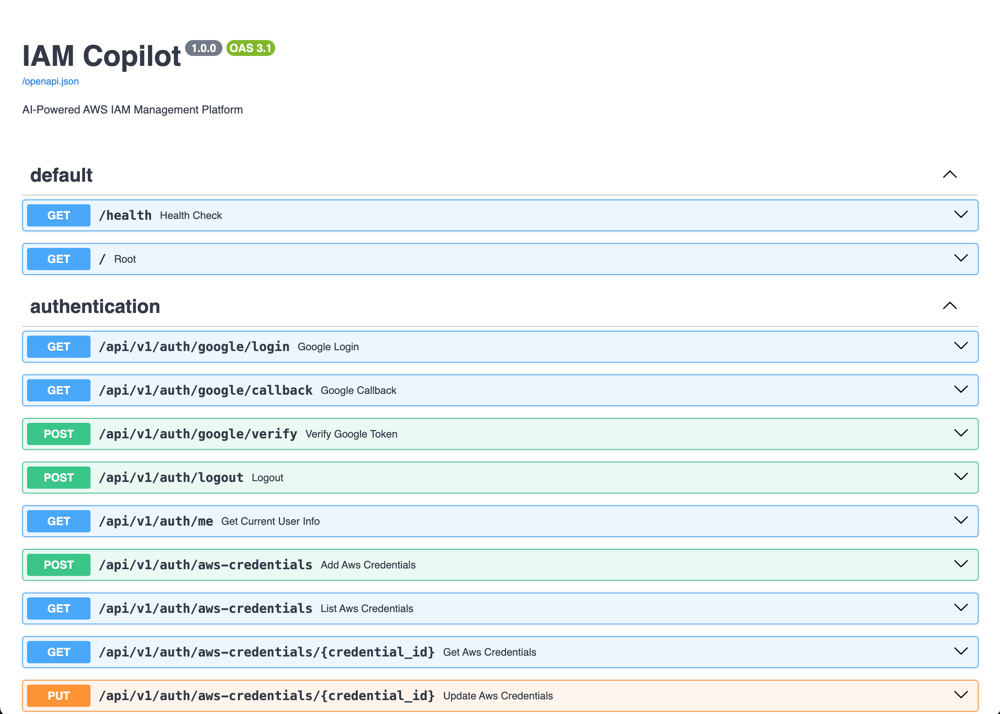

# IAM Copilot

<div align="center">

**AI-Powered AWS IAM Management Platform**


[](https://docs.docker.com/compose/)
[](https://www.python.org/)
[](https://reactjs.org/)


  
  [](https://www.docker.com/)
  [](https://nodejs.org/)
    <!-- [](https://astro.build/)
  [](https://tailwindcss.com/) -->

  [](https://github.com/jleboube/IAM-CoPilot/stargazers)
  [](https://github.com/jleboube/IAM-CoPilot/network/members)
  [](https://github.com/jleboube/IAM-CoPilot/issues)
  [](https://github.com/jleboube/IAM-CoPilot/pulls)
  [](https://creativecommons.org/licenses/by-nc-sa/4.0/)
  <!-- [](LICENSE) -->
  
  **Leave the CLI behind and allow IAM-CoPilot guide you through your IAM journey with our GUI and GenAI natural language assistant!**
  
  [Demo](https://iam-copilot.com) • [Features](#key-capabilities) • [Quick Start](#quick-start) • [Screenshots](#screenshots)

  [](https://www.buymeacoffee.com/muscl3n3rd)

</div>

**IAM Copilot** is a developer-first, AI-powered platform that simplifies AWS IAM management. Generate policies from plain English, audit permissions, visualize access graphs, and enforce least-privilege principles—all powered by Amazon Bedrock (Claude 3.5 Sonnet).

## Key Capabilities

- **132 AWS Condition Keys** validated across 14 services (S3, EC2, IAM, KMS, Lambda, DynamoDB, RDS, and more)
- **37 Condition Operators** with intelligent type checking
- **Real-Time Validation** with IDE-ready autocomplete for policy authoring
- **AI-Powered Code Generation** that automatically adapts to AWS API changes
- **Zero-Touch Maintenance** with automated agent workflows for AWS updates

## Features

### Core IAM Management
- **Natural Language Policy Builder** - Generate IAM policies from plain English descriptions using Claude 3.5 Sonnet
- **Least-Privilege Auditor** - Scan roles and suggest permission reductions
- **Interactive Access Graph** - Visualize IAM relationships with D3.js
- **Policy Simulator** - Test policies before deployment
- **Multi-Account Support** - Manage IAM across AWS Organizations
- **GitHub Action Integration** - Automate IAM fixes in CI/CD

### Advanced Policy Validation
- **Real-Time Condition Key Validation** - Validate policies against 132 AWS condition keys across 14 services
- **Intelligent Autocomplete** - IDE-ready suggestions for condition keys and operators
- **Comprehensive Error Detection** - Catch operator/key type mismatches, invalid values, and security issues
- **Security Best Practices** - Automatic recommendations for MFA, IP restrictions, and least privilege
- **Permissions Boundary Management** - Set and manage permissions boundaries on IAM users and roles

### Automated Maintenance
- **AWS API Monitoring Agent** - Tracks changes to AWS IAM APIs (new operations, deprecations, parameter changes)
- **IAM API Update Agent** - Automatically generates code updates when AWS releases new IAM APIs
- **Intelligent Code Generation** - Uses Claude 3.5 Sonnet to create production-ready service methods, schemas, and endpoints
- **Change Tracking** - Full audit trail of automated code changes with human review workflow

### Screenshots

Dashboard - Your landing page for IAM CoPilot



Generate IAM Policies with natural language using GenAI.  Tell the prompt what you are trying to accomplish and let it produce the policy for you.



Everyone loves IAM audits, said no one, ever.  However, IAM CoPilot aims to make IAM audits less painful.  At a minimum, using our GUI takes 3%* of the stress away from the process. *Claims have not been verified by independent thrid party.


Let IAM CoPilot create interactive Access Graphs for your use cases.  See exactly how access is mapped for a given AWS ID.



IAM is bad enough, why'd you have to add Identity Center too?!?  Well, we are trying to remove all of the end user's pain and obfuscate the ins and outs of interacting with AWS IAM APIs.  

Here is a sample Access Graph created by IAM CoPilot.  Check it out.  A bunch of colored circles with a bunch of text under the circles.  Fun!





Yes!  We support AWS Organizations too!  In order to effectively take the pain out of AWS IAM, we included AWS Organizations in the party.



We got API docs!




## Architecture

```
┌─────────────┐     ┌─────────────┐     ┌─────────────┐
│   React     │────▶│  FastAPI    │────▶│   Amazon    │
│  Frontend   │     │   Backend   │     │   Bedrock   │
│  (Port 3000)│     │  (Port 8000)│     │   (Claude)  │
└─────────────┘     └─────────────┘     └─────────────┘
                           │
                           ├────▶ PostgreSQL
                           ├────▶ Redis
                           └────▶ Celery Worker
```

## Quick Start

### Prerequisites

- Docker & Docker Compose
- AWS Account with:
  - IAM permissions (see [FIX-PERMISSIONS.md](FIX-PERMISSIONS.md))
  - Amazon Bedrock access (Claude 3.5 Sonnet)
  - AWS credentials configured
- Google OAuth Client (see [GOOGLE_OAUTH_DEPLOYMENT_GUIDE.md](GOOGLE_OAUTH_DEPLOYMENT_GUIDE.md))

### 1. Clone the Repository

```bash
git clone <your-repo-url>
cd IAM-Copilot
```

### 2. Configure Environment

```bash
# Copy the example environment file
cp .env.example .env

# Edit .env with your AWS credentials
nano .env
```

**Required environment variables:**

```bash
# AWS Configuration
AWS_ACCESS_KEY_ID=your_access_key_id
AWS_SECRET_ACCESS_KEY=your_secret_access_key
AWS_REGION=us-east-1

# Database
DB_PASSWORD=your_secure_password

# Security (for encrypting stored AWS credentials)
SECRET_KEY=your_secret_key

# Google OAuth
GOOGLE_CLIENT_ID=your-client-id.apps.googleusercontent.com
GOOGLE_CLIENT_SECRET=your-client-secret
GOOGLE_REDIRECT_URI=http://localhost:8000/api/v1/auth/google/callback

# Frontend (Google OAuth)
VITE_API_URL=http://localhost:8000
VITE_GOOGLE_CLIENT_ID=your-client-id.apps.googleusercontent.com
```

**Generate a secure SECRET_KEY:**

```bash
openssl rand -hex 32
```

**Google OAuth Setup:**

See [GOOGLE_OAUTH_DEPLOYMENT_GUIDE.md](GOOGLE_OAUTH_DEPLOYMENT_GUIDE.md) for detailed instructions on creating a Google OAuth client.

### 3. Start the Application

```bash
# Build and start all services
docker compose up --build

# Or run in detached mode
docker compose up -d --build
```

**Services will be available at:**

- **Frontend**: http://localhost:3000
- **API**: http://localhost:8000
- **API Docs**: http://localhost:8000/docs
- **PostgreSQL**: localhost:5432
- **Redis**: localhost:6379

### 4. Verify Deployment

```bash
# Check all services are running
docker compose ps

# Check API health
curl http://localhost:8000/health

# View logs
docker compose logs -f api
docker compose logs -f worker
docker compose logs -f web
```

## Usage

### Authentication

IAM Copilot uses **Google OAuth** for secure user authentication:

1. Navigate to http://localhost:3000
2. Click "Sign in with Google"
3. Authenticate with your Google account
4. You'll be redirected to the dashboard

All users have their own isolated AWS credentials and audit logs. See [GOOGLE_OAUTH_DEPLOYMENT_GUIDE.md](GOOGLE_OAUTH_DEPLOYMENT_GUIDE.md) for production deployment.

### Generate a Policy

1. Navigate to http://localhost:3000/generate
2. Enter a natural language description:
   ```
   Allow Lambda function to read objects from S3 bucket named 'my-data' and write logs to CloudWatch
   ```
3. Click "Generate Policy with AI"
4. Review and copy the generated IAM policy JSON

### Run an Audit

1. Navigate to http://localhost:3000/audit
2. Enter your AWS Account ID
3. Select audit scope (Roles, Users, Policies, or All)
4. Click "Start Security Audit"
5. Review findings and recommendations

### View Access Graph

1. Navigate to http://localhost:3000/graph
2. Enter your AWS Account ID
3. Click "Generate Access Graph"
4. Interact with the D3.js visualization

## API Endpoints

### Policy Generation

```bash
POST /api/v1/policies/generate
```

**Request:**

```json
{
  "description": "Allow Lambda to read S3 bucket",
  "resource_arns": ["arn:aws:s3:::my-bucket/*"],
  "principal_type": "role"
}
```

**Response:**

```json
{
  "policy_id": 1,
  "name": "iam-copilot-allow-lambda-read",
  "policy_json": {
    "Version": "2012-10-17",
    "Statement": [...]
  },
  "validation_status": "valid"
}
```

### Policy Simulation

```bash
POST /api/v1/policies/simulate
```

### Start Audit

```bash
POST /api/v1/policies/audit
```

### Access Graph

```bash
GET /api/v1/policies/access-graph/{account_id}
```

### Policy Validation

#### Comprehensive Policy Validation

```bash
POST /api/v1/policy-validation/validate
```

**Request:**

```json
{
  "policy_document": {
    "Version": "2012-10-17",
    "Statement": [
      {
        "Effect": "Allow",
        "Action": "s3:GetObject",
        "Resource": "arn:aws:s3:::my-bucket/*",
        "Condition": {
          "IpAddress": {
            "aws:SourceIp": "192.168.1.0/24"
          }
        }
      }
    ]
  },
  "validation_level": "comprehensive"
}
```

**Response:**

```json
{
  "valid": true,
  "errors": [],
  "warnings": [],
  "suggestions": [],
  "info": ["Statement: aws:SourceIp - Source IP address of the requester"],
  "validation_level": "comprehensive",
  "summary": "✓ Policy is valid"
}
```

#### Condition Key Autocomplete

```bash
POST /api/v1/policy-validation/condition-keys/suggest
```

**Request:**

```json
{
  "service": "s3",
  "prefix": "s3:x-amz"
}
```

**Response:**

```json
{
  "suggestions": [
    {
      "key": "s3:x-amz-acl",
      "type": "String",
      "description": "Canned ACL for S3 object"
    }
  ],
  "total": 11,
  "service": "s3"
}
```

#### Real-Time Condition Validation

```bash
POST /api/v1/policy-validation/validate-condition
```

Perfect for IDE integrations - validates individual conditions as users type.

#### Get Condition Operators

```bash
GET /api/v1/policy-validation/condition-keys/operators
```

Returns all 37 AWS condition operators with their data types.

#### Permissions Boundary Management

```bash
POST /api/v1/policy-validation/permissions-boundary/set
POST /api/v1/policy-validation/permissions-boundary/delete
```

Set or remove permissions boundaries on IAM users and roles.

#### Service Health

```bash
GET /api/v1/policy-validation/health
```

Returns validation service status and catalog statistics (132 condition keys, 14 services supported).

### AI Agent Automation

#### Trigger IAM API Update Agent

```bash
POST /api/v1/agent/trigger
```

**Request:**

```json
{
  "monitoring_report_id": 123,
  "auto_apply": false
}
```

Triggers the agent to analyze AWS API changes and generate code updates. Default `auto_apply: false` for human review.

#### Get Agent Runs

```bash
GET /api/v1/agent/runs
GET /api/v1/agent/runs/{run_id}
```

View agent execution history and generated code changes.

#### Analyze Codebase

```bash
GET /api/v1/agent/analyze/{service}
```

Get current implementation status for a service (e.g., `IAM`, `S3`, `EC2`).

### API Monitoring

```bash
POST /api/v1/monitoring/trigger
GET /api/v1/monitoring/reports
GET /api/v1/monitoring/reports/{report_id}
```

Track AWS IAM API changes over time.

**Full API documentation available at:** http://localhost:8000/docs

## Development

### Project Structure

```
IAM-Copilot/
├── api/                    # FastAPI backend
│   ├── app/
│   │   ├── routers/       # API endpoints
│   │   ├── services/      # Business logic
│   │   ├── models/        # Database models
│   │   └── schemas/       # Pydantic schemas
│   ├── alembic/           # Database migrations
│   └── Dockerfile
├── worker/                # Celery worker
│   ├── app/
│   │   └── tasks.py       # Async tasks
│   └── Dockerfile
├── web/                   # React frontend
│   ├── src/
│   │   ├── components/    # React components
│   │   ├── services/      # API client
│   │   └── types/         # TypeScript types
│   └── Dockerfile
├── docker-compose.yml     # Orchestration
├── .env.example          # Environment template
└── README.md
```

### Local Development (Without Docker)

#### Backend

```bash
cd api
python -m venv venv
source venv/bin/activate  # Windows: venv\Scripts\activate
pip install -r requirements.txt
uvicorn app.main:app --reload
```

#### Frontend

```bash
cd web
npm install
npm run dev
```

#### Worker

```bash
cd worker
pip install -r requirements.txt
celery -A app.celery_app worker --loglevel=info
```

### Database Migrations

```bash
# Generate migration
docker compose exec api alembic revision --autogenerate -m "description"

# Apply migrations
docker compose exec api alembic upgrade head

# Rollback
docker compose exec api alembic downgrade -1
```

## AWS Permissions Required

The application needs the following AWS permissions:

```json
{
  "Version": "2012-10-17",
  "Statement": [
    {
      "Effect": "Allow",
      "Action": [
        "iam:ListRoles",
        "iam:ListUsers",
        "iam:ListPolicies",
        "iam:GetPolicy",
        "iam:GetPolicyVersion",
        "iam:GetRole",
        "iam:GetRolePolicy",
        "iam:ListRolePolicies",
        "iam:ListAttachedRolePolicies",
        "iam:SimulatePrincipalPolicy",
        "iam:SimulateCustomPolicy",
        "iam:CreatePolicy",
        "iam:GetAccountAuthorizationDetails",
        "iam:PutUserPermissionsBoundary",
        "iam:PutRolePermissionsBoundary",
        "iam:DeleteUserPermissionsBoundary",
        "iam:DeleteRolePermissionsBoundary",
        "bedrock:InvokeModel",
        "cloudtrail:LookupEvents",
        "organizations:ListAccounts",
        "organizations:DescribeOrganization",
        "organizations:ListPolicies",
        "organizations:DescribePolicy",
        "organizations:CreatePolicy",
        "organizations:UpdatePolicy",
        "organizations:DeletePolicy",
        "organizations:AttachPolicy",
        "organizations:DetachPolicy",
        "identitystore:ListUsers",
        "identitystore:ListGroups",
        "sso:ListInstances",
        "sso:ListPermissionSets",
        "sso:DescribePermissionSet",
        "sts:AssumeRole"
      ],
      "Resource": "*"
    }
  ]
}
```

## Production Deployment

### Security Checklist

- [ ] Set strong `DB_PASSWORD`
- [ ] Generate secure `SECRET_KEY` (use `openssl rand -hex 32`)
- [ ] Use IAM roles instead of access keys where possible
- [ ] Enable SSL/TLS with reverse proxy (nginx, Caddy, etc.)
- [ ] Update `CORS_ORIGINS` with your domain
- [ ] Use AWS Secrets Manager for sensitive values
- [ ] Enable database backups
- [ ] Configure log aggregation
- [ ] Set up monitoring and alerts
- [ ] Enable rate limiting
- [ ] Review and restrict AWS IAM permissions

### Deploy to AWS ECS

1. Build and push images to ECR:

```bash
# Authenticate to ECR
aws ecr get-login-password --region us-east-1 | docker login --username AWS --password-stdin <account-id>.dkr.ecr.us-east-1.amazonaws.com

# Tag and push
docker compose build
docker tag iam-copilot-api:latest <account-id>.dkr.ecr.us-east-1.amazonaws.com/iam-copilot-api:latest
docker push <account-id>.dkr.ecr.us-east-1.amazonaws.com/iam-copilot-api:latest
```

2. Create ECS task definitions
3. Deploy services with ECS
4. Use Application Load Balancer
5. Configure RDS for PostgreSQL
6. Use ElastiCache for Redis

### Environment Variables

See `.env.example` for all available configuration options.

## Testing

```bash
# Run backend tests
docker compose exec api pytest

# Run frontend tests
docker compose exec web npm test

# Integration tests with LocalStack
docker compose -f docker-compose.test.yml up
```

## Troubleshooting

### API returns 500 errors

Check AWS credentials are valid:

```bash
docker compose exec api python -c "import boto3; print(boto3.client('sts').get_caller_identity())"
```

### Bedrock access denied

Ensure you have:

1. Amazon Bedrock enabled in your region
2. Model access granted for Claude 3.5 Sonnet
3. Correct IAM permissions

### Database connection errors

```bash
# Check PostgreSQL is running
docker compose exec db pg_isready -U admin

# Check database exists
docker compose exec db psql -U admin -d iam_copilot -c "\dt"
```

### Worker not processing tasks

```bash
# Check Redis connection
docker compose exec redis redis-cli ping

# View worker logs
docker compose logs -f worker
```

## Contributing

1. Fork the repository
2. Create a feature branch (`git checkout -b feature/amazing-feature`)
3. Commit your changes (`git commit -m 'Add amazing feature'`)
4. Push to the branch (`git push origin feature/amazing-feature`)
5. Open a Pull Request

## License

This project is licensed under the CC BY-NC-SA 4.0 License.

## Support

- Documentation: See PRD in `AWS-IAM-CoPilot-PRD.md`
- Issues: [GitHub Issues](https://github.com/your-org/iam-copilot/issues)
- Email: support@your-domain.com

## Acknowledgments

- Built with [Amazon Bedrock](https://aws.amazon.com/bedrock/)
- Powered by [Claude 3.5 Sonnet](https://www.anthropic.com/claude)
- UI components inspired by modern design systems

---

**IAM Copilot: Built with AWS SDK. Deployed with Docker Compose. Securing the cloud, one policy at a time.**
